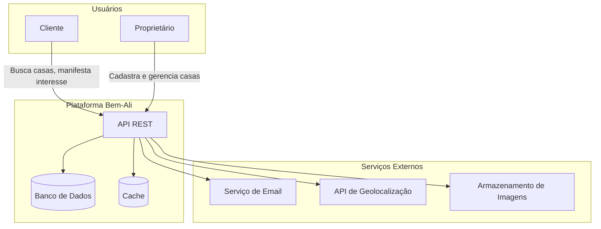
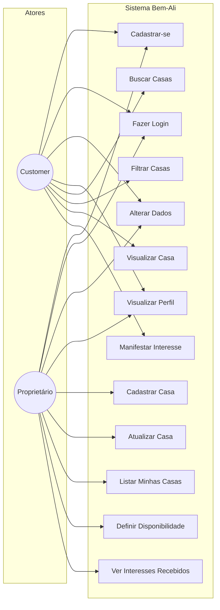
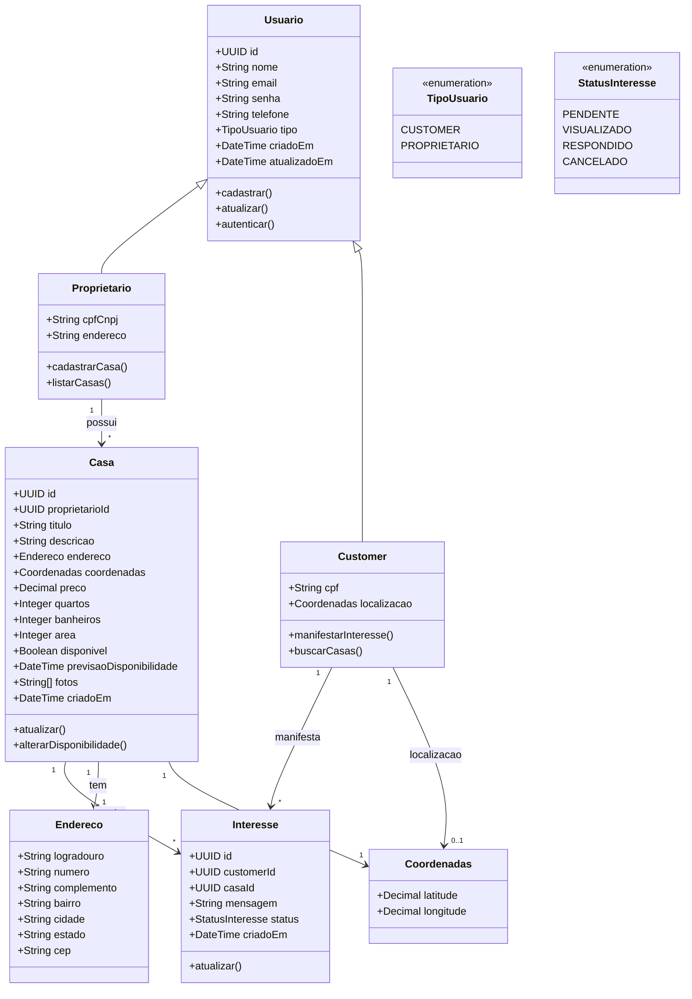
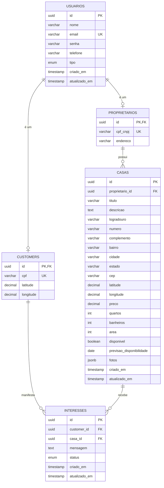
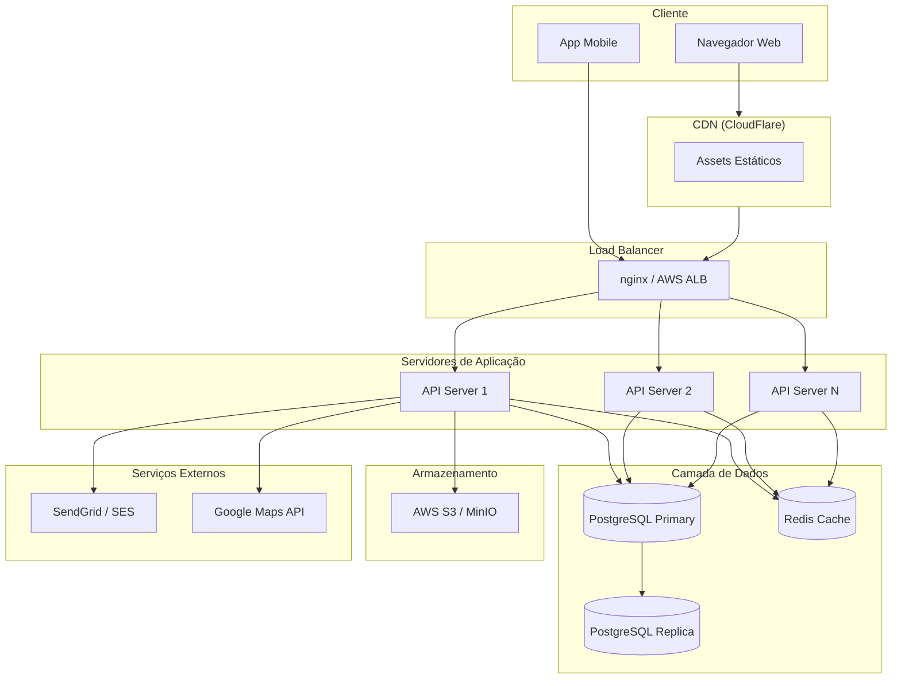
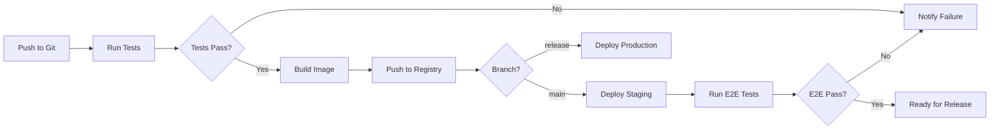
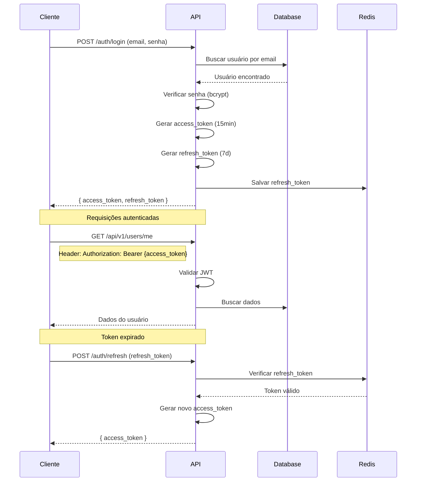
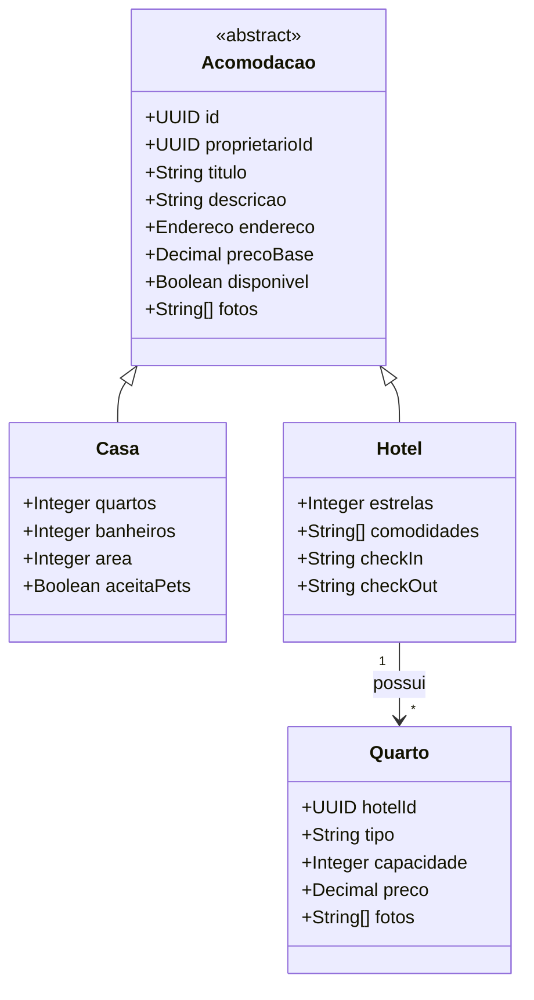

# Documento de Arquitetura de Software
## Plataforma Bem-Ali

**Versão:** 1.0
**Data:** Dezembro 2025
**Status:** MVP

---

## Sumário

1. [Introdução](#1-introdução)
2. [Visão Geral da Arquitetura](#2-visão-geral-da-arquitetura)
3. [Requisitos](#3-requisitos)
4. [Casos de Uso](#4-casos-de-uso)
5. [Modelo de Domínio](#5-modelo-de-domínio)
6. [Modelo de Dados](#6-modelo-de-dados)
7. [Visão de APIs](#7-visão-de-apis)
8. [Visão de Deployment](#8-visão-de-deployment)
9. [Stack Tecnológico](#9-stack-tecnológico)
10. [Segurança](#10-segurança)
11. [Extensibilidade](#11-extensibilidade)

---

## 1. Introdução

### 1.1 Propósito

Este documento descreve a arquitetura de software da plataforma **Bem-Ali**, um sistema de aluguel de acomodações que conecta proprietários de imóveis a clientes em busca de moradia.

### 1.2 Escopo

**MVP (Versão Atual):**
- Gestão de usuários (Clientes e Proprietários)
- Cadastro e gerenciamento de casas
- Busca de casas com filtros
- Sistema de manifestação de interesse

**Futuro:**
- Suporte a hotéis e quartos
- Sistema de reservas e pagamentos
- Avaliações e reviews

### 1.3 Definições e Abreviações

| Termo | Definição |
|-------|-----------|
| **Customer** | Cliente que busca acomodações para alugar |
| **Proprietário** | Usuário que cadastra e gerencia casas |
| **Casa** | Imóvel residencial disponível para aluguel |
| **Interesse** | Manifestação de interesse de um cliente em uma casa |
| **MVP** | Minimum Viable Product (Produto Mínimo Viável) |
| **API** | Application Programming Interface |
| **REST** | Representational State Transfer |
| **JWT** | JSON Web Token |

### 1.4 Visão do Produto

A plataforma Bem-Ali visa simplificar o processo de busca e aluguel de casas, oferecendo:

- **Para Clientes:** Busca intuitiva com filtros avançados e visualização detalhada de propriedades
- **Para Proprietários:** Gestão simplificada de múltiplos imóveis com controle de disponibilidade

---

## 2. Visão Geral da Arquitetura

### 2.1 Estilo Arquitetural

A plataforma adota uma arquitetura **Cliente-Servidor** baseada em **REST API**, seguindo o padrão de camadas:

```
┌─────────────────────────────────────────────────────────┐
│                    CAMADA DE APRESENTAÇÃO               │
│              (Web App / Mobile App / PWA)               │
└─────────────────────────────────────────────────────────┘
                            │
                            ▼
┌─────────────────────────────────────────────────────────┐
│                      API GATEWAY                        │
│            (Autenticação, Rate Limiting, CORS)          │
└─────────────────────────────────────────────────────────┘
                            │
                            ▼
┌─────────────────────────────────────────────────────────┐
│                   CAMADA DE APLICAÇÃO                   │
│                      (REST API)                         │
│  ┌─────────────┐ ┌─────────────┐ ┌─────────────────┐   │
│  │   Users     │ │   Casas     │ │   Interesses    │   │
│  │   Module    │ │   Module    │ │     Module      │   │
│  └─────────────┘ └─────────────┘ └─────────────────┘   │
└─────────────────────────────────────────────────────────┘
                            │
                            ▼
┌─────────────────────────────────────────────────────────┐
│                   CAMADA DE DADOS                       │
│              (PostgreSQL + Redis Cache)                 │
└─────────────────────────────────────────────────────────┘
```

### 2.2 Diagrama de Contexto



### 2.3 Componentes Principais

| Componente | Responsabilidade |
|------------|------------------|
| **API REST** | Processamento de requisições, regras de negócio |
| **Auth Service** | Autenticação e autorização de usuários |
| **Users Module** | Gestão de perfis de clientes e proprietários |
| **Casas Module** | CRUD de casas, busca e filtros |
| **Interesses Module** | Gestão de manifestações de interesse |
| **Notification Service** | Envio de emails e notificações |
| **File Storage** | Armazenamento de imagens das casas |

---

## 3. Requisitos

### 3.1 Requisitos Funcionais

#### RF01 - Gestão de Usuários (Customer)
| ID | Descrição | Prioridade |
|----|-----------|------------|
| RF01.1 | O sistema deve permitir que clientes se cadastrem na plataforma | Alta |
| RF01.2 | O sistema deve permitir que clientes alterem seus dados | Alta |
| RF01.3 | O sistema deve permitir que clientes visualizem seus dados | Alta |

#### RF02 - Gestão de Usuários (Proprietário)
| ID | Descrição | Prioridade |
|----|-----------|------------|
| RF02.1 | O sistema deve permitir que proprietários se cadastrem na plataforma | Alta |
| RF02.2 | O sistema deve permitir que proprietários alterem seus dados | Alta |
| RF02.3 | O sistema deve permitir que proprietários visualizem seus dados | Alta |

#### RF03 - Gestão de Casas (Proprietário)
| ID | Descrição | Prioridade |
|----|-----------|------------|
| RF03.1 | O sistema deve permitir que proprietários cadastrem uma ou mais casas | Alta |
| RF03.2 | O sistema deve permitir que proprietários atualizem dados de uma casa | Alta |
| RF03.3 | O sistema deve permitir que proprietários busquem dados de uma casa | Alta |
| RF03.4 | O sistema deve permitir que proprietários listem todas suas casas | Alta |
| RF03.5 | O sistema deve permitir que proprietários informem disponibilidade da casa | Alta |
| RF03.6 | O sistema deve permitir que proprietários informem previsão de disponibilidade | Média |

#### RF04 - Busca de Casas (Customer)
| ID | Descrição | Prioridade |
|----|-----------|------------|
| RF04.1 | O sistema deve permitir que clientes visualizem dados de uma casa | Alta |
| RF04.2 | O sistema deve permitir que clientes listem todas as casas | Alta |
| RF04.3 | O sistema deve permitir busca por proximidade (geolocalização) | Média |
| RF04.4 | O sistema deve permitir filtros por disponibilidade, preço, quartos, etc | Alta |
| RF04.5 | O sistema deve permitir que clientes manifestem interesse em uma casa | Alta |

### 3.2 Requisitos Não-Funcionais

| ID | Categoria | Descrição | Métrica |
|----|-----------|-----------|---------|
| RNF01 | Performance | Tempo de resposta da API | < 200ms (p95) |
| RNF02 | Performance | Tempo de carregamento inicial | < 3 segundos |
| RNF03 | Disponibilidade | Uptime do sistema | 99.5% |
| RNF04 | Escalabilidade | Usuários simultâneos | 1.000 (MVP) |
| RNF05 | Segurança | Autenticação | JWT com refresh token |
| RNF06 | Segurança | Dados sensíveis | Criptografia em trânsito (HTTPS) |
| RNF07 | Segurança | Senhas | Hash com bcrypt (cost 12) |
| RNF08 | Usabilidade | Responsividade | Mobile-first design |
| RNF09 | Manutenibilidade | Cobertura de testes | > 80% |
| RNF10 | Compatibilidade | Navegadores | Chrome, Firefox, Safari, Edge |

---

## 4. Casos de Uso

### 4.1 Diagrama de Casos de Uso



### 4.2 Especificação dos Casos de Uso

#### UC05 - Cadastrar Casa

| Campo | Descrição |
|-------|-----------|
| **Ator Principal** | Proprietário |
| **Pré-condições** | Usuário autenticado como Proprietário |
| **Pós-condições** | Casa cadastrada e visível para clientes |

**Fluxo Principal:**
1. Proprietário acessa a opção "Nova Casa"
2. Sistema exibe formulário de cadastro
3. Proprietário preenche dados: título, descrição, endereço, preço, quartos, banheiros
4. Proprietário faz upload de fotos
5. Proprietário define status de disponibilidade
6. Sistema valida os dados
7. Sistema salva a casa
8. Sistema confirma o cadastro

**Fluxos Alternativos:**
- **4a.** Formato de imagem inválido: Sistema exibe erro e solicita nova imagem
- **6a.** Dados obrigatórios faltando: Sistema destaca campos pendentes

---

#### UC09 - Buscar Casas

| Campo | Descrição |
|-------|-----------|
| **Ator Principal** | Customer |
| **Pré-condições** | Nenhuma (busca pública) |
| **Pós-condições** | Lista de casas exibida |

**Fluxo Principal:**
1. Cliente acessa a página de busca
2. Sistema exibe campo de busca e filtros
3. Cliente (opcional) aplica filtros: localização, preço, quartos
4. Sistema processa a busca
5. Sistema exibe lista de casas com preview
6. Cliente seleciona uma casa para ver detalhes

**Fluxos Alternativos:**
- **5a.** Nenhuma casa encontrada: Sistema exibe mensagem e sugestões

---

#### UC12 - Manifestar Interesse

| Campo | Descrição |
|-------|-----------|
| **Ator Principal** | Customer |
| **Pré-condições** | Usuário autenticado como Customer |
| **Pós-condições** | Interesse registrado, Proprietário notificado |

**Fluxo Principal:**
1. Cliente visualiza detalhes de uma casa
2. Cliente clica em "Tenho Interesse"
3. Sistema exibe formulário com mensagem opcional
4. Cliente confirma o interesse
5. Sistema registra o interesse
6. Sistema notifica o proprietário por email
7. Sistema confirma ao cliente

---

## 5. Modelo de Domínio

### 5.1 Diagrama de Classes



### 5.2 Descrição das Entidades

#### Usuario (Base)
Entidade base para todos os usuários do sistema.

| Atributo | Tipo | Obrigatório | Descrição |
|----------|------|-------------|-----------|
| id | UUID | Sim | Identificador único |
| nome | String(100) | Sim | Nome completo |
| email | String(255) | Sim | Email único |
| senha | String(255) | Sim | Hash da senha |
| telefone | String(20) | Sim | Telefone com DDD |
| tipo | Enum | Sim | CUSTOMER ou PROPRIETARIO |
| criadoEm | DateTime | Sim | Data de criação |
| atualizadoEm | DateTime | Sim | Última atualização |

#### Casa
Imóvel disponível para aluguel.

| Atributo | Tipo | Obrigatório | Descrição |
|----------|------|-------------|-----------|
| id | UUID | Sim | Identificador único |
| proprietarioId | UUID | Sim | FK para Proprietário |
| titulo | String(150) | Sim | Título do anúncio |
| descricao | Text | Sim | Descrição detalhada |
| preco | Decimal(10,2) | Sim | Valor do aluguel mensal |
| quartos | Integer | Sim | Quantidade de quartos |
| banheiros | Integer | Sim | Quantidade de banheiros |
| area | Integer | Não | Área em m² |
| disponivel | Boolean | Sim | Status atual |
| previsaoDisponibilidade | Date | Não | Quando estará disponível |
| fotos | String[] | Sim | URLs das fotos |

#### Interesse
Manifestação de interesse de um cliente em uma casa.

| Atributo | Tipo | Obrigatório | Descrição |
|----------|------|-------------|-----------|
| id | UUID | Sim | Identificador único |
| customerId | UUID | Sim | FK para Customer |
| casaId | UUID | Sim | FK para Casa |
| mensagem | Text | Não | Mensagem opcional |
| status | Enum | Sim | Status do interesse |
| criadoEm | DateTime | Sim | Data da manifestação |

---

## 6. Modelo de Dados

### 6.1 Diagrama Entidade-Relacionamento



### 6.2 Scripts DDL

```sql
-- Extensões necessárias
CREATE EXTENSION IF NOT EXISTS "uuid-ossp";
CREATE EXTENSION IF NOT EXISTS "postgis";

-- Tipos ENUM
CREATE TYPE tipo_usuario AS ENUM ('CUSTOMER', 'PROPRIETARIO');
CREATE TYPE status_interesse AS ENUM ('PENDENTE', 'VISUALIZADO', 'RESPONDIDO', 'CANCELADO');

-- Tabela de Usuários
CREATE TABLE usuarios (
    id UUID PRIMARY KEY DEFAULT uuid_generate_v4(),
    nome VARCHAR(100) NOT NULL,
    email VARCHAR(255) NOT NULL UNIQUE,
    senha VARCHAR(255) NOT NULL,
    telefone VARCHAR(20) NOT NULL,
    tipo tipo_usuario NOT NULL,
    criado_em TIMESTAMP WITH TIME ZONE DEFAULT CURRENT_TIMESTAMP,
    atualizado_em TIMESTAMP WITH TIME ZONE DEFAULT CURRENT_TIMESTAMP
);

-- Tabela de Proprietários
CREATE TABLE proprietarios (
    id UUID PRIMARY KEY REFERENCES usuarios(id) ON DELETE CASCADE,
    cpf_cnpj VARCHAR(18) NOT NULL UNIQUE,
    endereco VARCHAR(255)
);

-- Tabela de Customers
CREATE TABLE customers (
    id UUID PRIMARY KEY REFERENCES usuarios(id) ON DELETE CASCADE,
    cpf VARCHAR(14) NOT NULL UNIQUE,
    localizacao GEOGRAPHY(POINT, 4326)
);

-- Tabela de Casas
CREATE TABLE casas (
    id UUID PRIMARY KEY DEFAULT uuid_generate_v4(),
    proprietario_id UUID NOT NULL REFERENCES proprietarios(id) ON DELETE CASCADE,
    titulo VARCHAR(150) NOT NULL,
    descricao TEXT NOT NULL,
    logradouro VARCHAR(255) NOT NULL,
    numero VARCHAR(20) NOT NULL,
    complemento VARCHAR(100),
    bairro VARCHAR(100) NOT NULL,
    cidade VARCHAR(100) NOT NULL,
    estado CHAR(2) NOT NULL,
    cep VARCHAR(9) NOT NULL,
    localizacao GEOGRAPHY(POINT, 4326),
    preco DECIMAL(10, 2) NOT NULL,
    quartos INTEGER NOT NULL CHECK (quartos >= 0),
    banheiros INTEGER NOT NULL CHECK (banheiros >= 0),
    area INTEGER CHECK (area > 0),
    disponivel BOOLEAN NOT NULL DEFAULT true,
    previsao_disponibilidade DATE,
    fotos JSONB NOT NULL DEFAULT '[]',
    criado_em TIMESTAMP WITH TIME ZONE DEFAULT CURRENT_TIMESTAMP,
    atualizado_em TIMESTAMP WITH TIME ZONE DEFAULT CURRENT_TIMESTAMP
);

-- Tabela de Interesses
CREATE TABLE interesses (
    id UUID PRIMARY KEY DEFAULT uuid_generate_v4(),
    customer_id UUID NOT NULL REFERENCES customers(id) ON DELETE CASCADE,
    casa_id UUID NOT NULL REFERENCES casas(id) ON DELETE CASCADE,
    mensagem TEXT,
    status status_interesse NOT NULL DEFAULT 'PENDENTE',
    criado_em TIMESTAMP WITH TIME ZONE DEFAULT CURRENT_TIMESTAMP,
    atualizado_em TIMESTAMP WITH TIME ZONE DEFAULT CURRENT_TIMESTAMP,
    UNIQUE(customer_id, casa_id)
);

-- Índices
CREATE INDEX idx_casas_proprietario ON casas(proprietario_id);
CREATE INDEX idx_casas_disponivel ON casas(disponivel);
CREATE INDEX idx_casas_preco ON casas(preco);
CREATE INDEX idx_casas_quartos ON casas(quartos);
CREATE INDEX idx_casas_cidade ON casas(cidade);
CREATE INDEX idx_casas_localizacao ON casas USING GIST(localizacao);
CREATE INDEX idx_interesses_customer ON interesses(customer_id);
CREATE INDEX idx_interesses_casa ON interesses(casa_id);
CREATE INDEX idx_interesses_status ON interesses(status);

-- Trigger para atualizar timestamp
CREATE OR REPLACE FUNCTION update_atualizado_em()
RETURNS TRIGGER AS $$
BEGIN
    NEW.atualizado_em = CURRENT_TIMESTAMP;
    RETURN NEW;
END;
$$ LANGUAGE plpgsql;

CREATE TRIGGER trigger_usuarios_atualizado_em
    BEFORE UPDATE ON usuarios
    FOR EACH ROW EXECUTE FUNCTION update_atualizado_em();

CREATE TRIGGER trigger_casas_atualizado_em
    BEFORE UPDATE ON casas
    FOR EACH ROW EXECUTE FUNCTION update_atualizado_em();

CREATE TRIGGER trigger_interesses_atualizado_em
    BEFORE UPDATE ON interesses
    FOR EACH ROW EXECUTE FUNCTION update_atualizado_em();
```

---

## 7. Visão de APIs

### 7.1 Padrões da API

- **Formato:** JSON
- **Versionamento:** Via URL (`/api/v1/`)
- **Autenticação:** Bearer Token (JWT)
- **Códigos de Status:** HTTP padrão
- **Paginação:** Cursor-based ou offset-based

### 7.2 Endpoints

#### Autenticação

| Método | Endpoint | Descrição | Auth |
|--------|----------|-----------|------|
| POST | `/api/v1/auth/register` | Cadastrar usuário | Não |
| POST | `/api/v1/auth/login` | Fazer login | Não |
| POST | `/api/v1/auth/refresh` | Renovar token | Sim |
| POST | `/api/v1/auth/logout` | Fazer logout | Sim |
| POST | `/api/v1/auth/forgot-password` | Solicitar reset de senha | Não |
| POST | `/api/v1/auth/reset-password` | Resetar senha | Não |

#### Usuários

| Método | Endpoint | Descrição | Auth |
|--------|----------|-----------|------|
| GET | `/api/v1/users/me` | Obter perfil atual | Sim |
| PUT | `/api/v1/users/me` | Atualizar perfil | Sim |
| DELETE | `/api/v1/users/me` | Excluir conta | Sim |

#### Casas

| Método | Endpoint | Descrição | Auth |
|--------|----------|-----------|------|
| GET | `/api/v1/casas` | Listar casas (público) | Não |
| GET | `/api/v1/casas/:id` | Detalhes de uma casa | Não |
| POST | `/api/v1/casas` | Criar casa | Proprietário |
| PUT | `/api/v1/casas/:id` | Atualizar casa | Proprietário |
| DELETE | `/api/v1/casas/:id` | Remover casa | Proprietário |
| PATCH | `/api/v1/casas/:id/disponibilidade` | Alterar disponibilidade | Proprietário |
| GET | `/api/v1/proprietarios/me/casas` | Minhas casas | Proprietário |

#### Busca de Casas

| Método | Endpoint | Descrição | Auth |
|--------|----------|-----------|------|
| GET | `/api/v1/casas/busca` | Busca com filtros | Não |
| GET | `/api/v1/casas/proximas` | Casas próximas (geo) | Não |

**Query Parameters para busca:**
```
?cidade=São Paulo
&bairro=Pinheiros
&preco_min=1000
&preco_max=3000
&quartos_min=2
&disponivel=true
&ordenar=preco_asc
&pagina=1
&limite=20
&lat=-23.5505
&lng=-46.6333
&raio=5000
```

#### Interesses

| Método | Endpoint | Descrição | Auth |
|--------|----------|-----------|------|
| POST | `/api/v1/casas/:id/interesse` | Manifestar interesse | Customer |
| GET | `/api/v1/customers/me/interesses` | Meus interesses | Customer |
| GET | `/api/v1/proprietarios/me/interesses` | Interesses recebidos | Proprietário |
| PATCH | `/api/v1/interesses/:id/status` | Atualizar status | Proprietário |

### 7.3 Exemplos de Request/Response

#### POST /api/v1/auth/register

**Request:**
```json
{
  "nome": "João Silva",
  "email": "joao@email.com",
  "senha": "Senha@123",
  "telefone": "(11) 99999-9999",
  "tipo": "CUSTOMER",
  "cpf": "123.456.789-00"
}
```

**Response (201 Created):**
```json
{
  "success": true,
  "data": {
    "id": "550e8400-e29b-41d4-a716-446655440000",
    "nome": "João Silva",
    "email": "joao@email.com",
    "tipo": "CUSTOMER",
    "criadoEm": "2025-12-26T10:30:00Z"
  },
  "token": "eyJhbGciOiJIUzI1NiIsInR5cCI6IkpXVCJ9..."
}
```

#### POST /api/v1/casas

**Request:**
```json
{
  "titulo": "Casa espaçosa em Pinheiros",
  "descricao": "Casa com 3 quartos, quintal e garagem",
  "endereco": {
    "logradouro": "Rua dos Pinheiros",
    "numero": "1234",
    "complemento": "Casa 2",
    "bairro": "Pinheiros",
    "cidade": "São Paulo",
    "estado": "SP",
    "cep": "05422-000"
  },
  "preco": 3500.00,
  "quartos": 3,
  "banheiros": 2,
  "area": 120,
  "disponivel": true,
  "fotos": ["url1.jpg", "url2.jpg"]
}
```

**Response (201 Created):**
```json
{
  "success": true,
  "data": {
    "id": "550e8400-e29b-41d4-a716-446655440001",
    "titulo": "Casa espaçosa em Pinheiros",
    "preco": 3500.00,
    "quartos": 3,
    "disponivel": true,
    "criadoEm": "2025-12-26T10:30:00Z"
  }
}
```

#### GET /api/v1/casas/busca

**Response (200 OK):**
```json
{
  "success": true,
  "data": [
    {
      "id": "550e8400-e29b-41d4-a716-446655440001",
      "titulo": "Casa espaçosa em Pinheiros",
      "preco": 3500.00,
      "quartos": 3,
      "banheiros": 2,
      "bairro": "Pinheiros",
      "cidade": "São Paulo",
      "disponivel": true,
      "fotoPrincipal": "url1.jpg"
    }
  ],
  "meta": {
    "total": 45,
    "pagina": 1,
    "limite": 20,
    "totalPaginas": 3
  }
}
```

### 7.4 Códigos de Erro

| Código | Significado | Exemplo |
|--------|-------------|---------|
| 400 | Bad Request | Dados inválidos |
| 401 | Unauthorized | Token inválido/expirado |
| 403 | Forbidden | Sem permissão |
| 404 | Not Found | Recurso não encontrado |
| 409 | Conflict | Email já cadastrado |
| 422 | Unprocessable Entity | Validação falhou |
| 429 | Too Many Requests | Rate limit excedido |
| 500 | Internal Server Error | Erro interno |

**Formato de Erro:**
```json
{
  "success": false,
  "error": {
    "code": "VALIDATION_ERROR",
    "message": "Dados inválidos",
    "details": [
      {
        "field": "email",
        "message": "Email inválido"
      }
    ]
  }
}
```

---

## 8. Visão de Deployment

### 8.1 Diagrama de Deployment



### 8.2 Ambientes

| Ambiente | Propósito | URL |
|----------|-----------|-----|
| Development | Desenvolvimento local | localhost:3000 |
| Staging | Testes e QA | staging.bemali.com.br |
| Production | Produção | bemali.com.br |

### 8.3 Requisitos de Infraestrutura (MVP)

| Componente | Especificação | Quantidade |
|------------|---------------|------------|
| API Server | 2 vCPU, 4GB RAM | 2 |
| PostgreSQL | 2 vCPU, 8GB RAM, 100GB SSD | 1 + 1 replica |
| Redis | 1 vCPU, 2GB RAM | 1 |
| Storage | S3 ou equivalente | Ilimitado |

### 8.4 CI/CD Pipeline



---

## 9. Stack Tecnológico

### 9.1 Recomendação (Flexível)

| Camada | Tecnologia | Alternativas |
|--------|------------|--------------|
| **Frontend** | React + TypeScript | Vue.js, Next.js, Angular |
| **Mobile** | React Native | Flutter, PWA |
| **Backend** | Node.js + NestJS | FastAPI (Python), Spring Boot (Java) |
| **Banco de Dados** | PostgreSQL + PostGIS | MySQL, MongoDB |
| **Cache** | Redis | Memcached |
| **Storage** | AWS S3 | MinIO, Google Cloud Storage |
| **CDN** | CloudFlare | AWS CloudFront |
| **Email** | SendGrid | AWS SES, Mailgun |
| **Maps** | Google Maps API | Mapbox, OpenStreetMap |
| **Containerização** | Docker + Docker Compose | Podman |
| **Orquestração** | Kubernetes | Docker Swarm, ECS |
| **CI/CD** | GitHub Actions | GitLab CI, Jenkins |
| **Monitoramento** | Prometheus + Grafana | DataDog, New Relic |
| **Logs** | ELK Stack | Loki, CloudWatch |

### 9.2 Estrutura de Diretórios (Backend NestJS)

```
backend/
├── src/
│   ├── auth/
│   │   ├── auth.controller.ts
│   │   ├── auth.service.ts
│   │   ├── auth.module.ts
│   │   ├── strategies/
│   │   └── guards/
│   ├── users/
│   │   ├── users.controller.ts
│   │   ├── users.service.ts
│   │   ├── users.module.ts
│   │   ├── dto/
│   │   └── entities/
│   ├── casas/
│   │   ├── casas.controller.ts
│   │   ├── casas.service.ts
│   │   ├── casas.module.ts
│   │   ├── dto/
│   │   └── entities/
│   ├── interesses/
│   │   ├── interesses.controller.ts
│   │   ├── interesses.service.ts
│   │   ├── interesses.module.ts
│   │   ├── dto/
│   │   └── entities/
│   ├── common/
│   │   ├── filters/
│   │   ├── interceptors/
│   │   ├── decorators/
│   │   └── pipes/
│   ├── config/
│   ├── database/
│   │   └── migrations/
│   ├── app.module.ts
│   └── main.ts
├── test/
├── docker-compose.yml
├── Dockerfile
├── package.json
└── tsconfig.json
```

---

## 10. Segurança

### 10.1 Autenticação



### 10.2 Estrutura do JWT

```json
{
  "header": {
    "alg": "RS256",
    "typ": "JWT"
  },
  "payload": {
    "sub": "550e8400-e29b-41d4-a716-446655440000",
    "email": "joao@email.com",
    "tipo": "CUSTOMER",
    "iat": 1703587200,
    "exp": 1703588100
  }
}
```

### 10.3 Boas Práticas de Segurança

| Categoria | Prática | Implementação |
|-----------|---------|---------------|
| **Senhas** | Hashing seguro | bcrypt com cost 12 |
| **Tokens** | Assinatura assimétrica | RS256 (RSA + SHA256) |
| **Transporte** | Criptografia | TLS 1.3 (HTTPS) |
| **Headers** | Segurança HTTP | Helmet.js |
| **CORS** | Origens permitidas | Whitelist de domínios |
| **Rate Limiting** | Proteção contra DDoS | 100 req/min por IP |
| **Input** | Validação | class-validator, sanitização |
| **SQL** | Prevenção de injection | ORM (TypeORM/Prisma) |
| **XSS** | Prevenção | Escape de output, CSP |
| **CSRF** | Proteção | SameSite cookies |
| **Uploads** | Validação de arquivos | Tipo, tamanho, scan |

### 10.4 Headers de Segurança

```typescript
// Configuração Helmet.js
app.use(helmet({
  contentSecurityPolicy: {
    directives: {
      defaultSrc: ["'self'"],
      styleSrc: ["'self'", "'unsafe-inline'"],
      imgSrc: ["'self'", "data:", "https://storage.bemali.com.br"],
      scriptSrc: ["'self'"],
    },
  },
  hsts: {
    maxAge: 31536000,
    includeSubDomains: true,
  },
}));
```

---

## 11. Extensibilidade

### 11.1 Preparação para Hotéis

O modelo de dados foi projetado para suportar hotéis no futuro através de herança:



### 11.2 Roadmap de Funcionalidades

| Fase | Funcionalidades | Status |
|------|-----------------|--------|
| **MVP** | Casas, Busca, Interesse | Em desenvolvimento |
| **v1.1** | Sistema de Reservas | Planejado |
| **v1.2** | Hotéis e Quartos | Planejado |
| **v1.3** | Pagamentos Online | Planejado |
| **v1.4** | Avaliações e Reviews | Planejado |
| **v2.0** | App Mobile Nativo | Planejado |

### 11.3 Pontos de Extensão

1. **Novos Tipos de Acomodação:** Arquitetura baseada em herança permite adicionar apartamentos, pousadas, etc.

2. **Novos Métodos de Pagamento:** Interface de pagamento abstrata para integrar múltiplos gateways.

3. **Integrações:** Webhooks para notificar sistemas externos sobre eventos (nova reserva, cancelamento).

4. **Multi-idioma:** Estrutura preparada para i18n.

5. **Multi-moeda:** Suporte a diferentes moedas com conversão automática.

---

## Apêndices

### A. Glossário Técnico

| Termo | Definição |
|-------|-----------|
| PostGIS | Extensão espacial para PostgreSQL |
| JWT | Token de autenticação stateless |
| bcrypt | Algoritmo de hash para senhas |
| ORM | Object-Relational Mapping |
| CORS | Cross-Origin Resource Sharing |
| CDN | Content Delivery Network |

### B. Referências

- [NestJS Documentation](https://docs.nestjs.com/)
- [PostgreSQL Documentation](https://www.postgresql.org/docs/)
- [PostGIS Documentation](https://postgis.net/documentation/)
- [OWASP Security Guidelines](https://owasp.org/www-project-web-security-testing-guide/)
- [REST API Best Practices](https://restfulapi.net/)

---

**Documento mantido por:** Equipe Bem-Ali
**Última atualização:** Dezembro 2025
